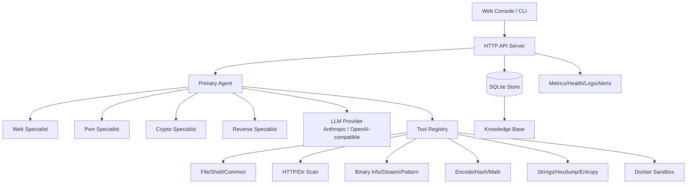

# CTF-Agent

[](https://github.com/Conly-Zy/CTF-Agent/actions/workflows/build.yml)
[](https://github.com/Conly-Zy/CTF-Agent/actions/workflows/docker.yml)

CTF-Agent is an AI-assisted CTF solving platform with a CLI, web console, multi-provider LLM support, specialist agents, sandboxed tools, replay/reporting, and a persistent knowledge base.

> 中文文档：[`readme_CN.md`](readme_CN.md)

## Highlights

- **Challenge coverage**: Web, Pwn, Crypto, Reverse, and common file/shell workflows.
- **Multi-agent solving**: A primary agent can delegate to Web/Pwn/Crypto/Reverse specialists, reflect on progress, and summarize findings.
- **LLM providers**: Anthropic Claude and OpenAI-compatible chat-completions endpoints.
- **Web console**: Dashboard, sessions, live solving, tool testing, knowledge search, config editing, metrics, logs, alerts, replay, and reports.
- **Knowledge base**: Automatically extracts reusable techniques, tags, commands, and snippets from solving sessions.
- **Sandbox support**: Docker-based execution helpers for safer challenge analysis.
- **One-command startup**: Fresh machines can run the published GHCR image with `./scripts/bootstrap.sh`.
- **CI/CD**: GitHub Actions build binaries, publish releases, and build multi-arch Docker images.

## Quick start from a fresh environment

Prerequisites: Docker with the Compose plugin, and an Anthropic or OpenAI-compatible API key.

```bash
git clone https://github.com/Conly-Zy/CTF-Agent.git
cd CTF-Agent

# Starts the GHCR Docker image, creates .env/data/uploads/logs automatically.
ANTHROPIC_API_KEY="your-api-key" ./scripts/bootstrap.sh
```

Open the web console:

```text
http://localhost:4399
```

Useful variants:

```bash
# Use OpenAI-compatible provider
LLM_PROVIDER=openai OPENAI_API_KEY="your-api-key" LLM_MODEL="gpt-4.1" ./scripts/bootstrap.sh

# Use a specific published image tag
CTF_AGENT_IMAGE_TAG=v0.3.0 ./scripts/bootstrap.sh

# Build the image locally instead of pulling GHCR
./scripts/bootstrap.sh --build
```

## Docker images

Published images are generated by GitHub Actions and pushed to GitHub Container Registry:

```text
ghcr.io/conly-zy/ctf-agent:latest
ghcr.io/conly-zy/ctf-agent:<git-tag>
ghcr.io/conly-zy/ctf-agent:sha-<short-sha>
```

Manual Docker commands:

```bash
# Pull/run the published image through Compose
cp .env.example .env
# edit .env, then:
docker compose up -d

# Local image build
docker compose -f docker-compose.yml -f docker-compose.build.yml up -d --build

# Stop
docker compose down
```

> If your shell is case-sensitive, use `docker compose down` for the stop command.

## Local development

Prerequisites:

- Go version from `go.mod`
- Node.js 24+ and npm
- Docker (optional, for sandbox and containerized startup)

```bash
# Build frontend + backend
make build

# Run tests
make test

# Start backend with local config
cp config.yaml.example config.yaml
ANTHROPIC_API_KEY="your-api-key" make dev-backend

# Start frontend dev server in another terminal
make dev-frontend
```

The production binary embeds the Vite frontend during `make build`.

## Configuration

Configuration can be supplied through `config.yaml`/`data/config.yaml` and environment variables. Environment variables are convenient for secrets and containers.

Minimal Anthropic setup:

```bash
export LLM_PROVIDER=anthropic
export ANTHROPIC_API_KEY="your-api-key"
export LLM_MODEL="claude-opus-4-7"
```

Minimal OpenAI-compatible setup:

```bash
export LLM_PROVIDER=openai
export OPENAI_API_KEY="your-api-key"
export LLM_MODEL="gpt-4.1"
# export LLM_BASE_URL="https://api.openai.com/v1"  # optional/custom endpoint
```

Example config file:

```yaml
llm:
  provider: anthropic
  api_key: ""
  model: claude-opus-4-7
  base_url: ""

agent:
  max_iterations: 50
  timeout: 10m
  verbose: false

sandbox:
  enabled: true
  image: ctf-agent-sandbox:latest
  timeout: 60s
  network_mode: bridge
```

Environment variables recognized by the app and startup scripts:

| Variable | Description | Default |
| --- | --- | --- |
| `LLM_PROVIDER` | `anthropic` or `openai` | `anthropic` |
| `LLM_API_KEY` | Generic provider API key override | empty |
| `ANTHROPIC_API_KEY` | Anthropic API key | empty |
| `OPENAI_API_KEY` | OpenAI-compatible API key | empty |
| `LLM_MODEL` | Model name override | provider default in config |
| `LLM_BASE_URL` | Custom OpenAI/Anthropic-compatible base URL | empty/provider default |
| `CTF_PORT` | Host port for Docker Compose | `4399` |
| `CTF_AGENT_IMAGE` | Docker image repository | `ghcr.io/conly-zy/ctf-agent` |
| `CTF_AGENT_IMAGE_TAG` | Docker image tag | `latest` |
| `CTF_AGENT_ADDR` | Server listen address inside container/local process | `:4399` |
| `CTF_AGENT_CONFIG` | Config path | `config.yaml` |
| `CTF_AGENT_DB` | SQLite database path | `ctf-agent.db` |

## CLI usage

### Web challenge

```bash
ctf-agent solve \
  --type web \
  --description "Find the flag in this web application" \
  --target "http://challenge.example.com"
```

### Pwn challenge

```bash
ctf-agent solve \
  --type pwn \
  --description "Exploit this binary to get the flag" \
  --files ./challenge.elf
```

### Crypto challenge

```bash
ctf-agent solve \
  --type crypto \
  --description "Decrypt this ciphertext" \
  --files ./ciphertext.txt
```

### Reverse challenge

```bash
ctf-agent solve \
  --type reverse \
  --description "Reverse engineer this binary" \
  --files ./binary.exe
```

### Web server

```bash
ctf-agent server --addr :4399 --config config.yaml --db ctf-agent.db
```

## Make targets

```bash
make help
make build          # frontend + Go binary
make test           # Go tests
make fmt            # go fmt
make docker         # local docker build
make docker-up      # start published image through Compose
make docker-up-build # start locally-built image through Compose
make docker-down    # stop Compose stack
make setup          # one-command bootstrap
```

## Architecture



## API overview

| Method | Endpoint | Description |
| --- | --- | --- |
| `GET` | `/api/dashboard` | Dashboard statistics |
| `GET` | `/api/sessions` | List sessions |
| `GET` | `/api/sessions/{id}` | Session details |
| `GET` | `/api/sessions/{id}/messages` | Session conversation |
| `POST` | `/api/solve` | Start solving task |
| `POST` | `/api/upload` | Upload challenge files |
| `GET` | `/api/knowledge` | List knowledge entries |
| `GET` | `/api/knowledge/search?q=` | Search knowledge |
| `GET` | `/api/tools` | List registered tools |
| `GET` | `/api/config` | Read active config |
| `GET` | `/api/metrics` | Metrics summary |
| `GET` | `/api/health` | Full health report |
| `GET` | `/api/health/live` | Liveness probe |
| `GET` | `/api/health/ready` | Readiness probe |
| `GET` | `/ws` | WebSocket updates |

## Project structure

```text
CTF-Agent/
├── cmd/ctf-agent/          # CLI entry point and embedded web assets
├── internal/agent/         # Primary/specialist agents, reflection, summaries
├── internal/api/           # HTTP API, WebSocket, handlers
├── internal/config/        # YAML/env configuration
├── internal/knowledge/     # Knowledge extraction
├── internal/llm/           # Anthropic and OpenAI-compatible providers
├── internal/tools/         # Common/Web/Pwn/Crypto/Reverse tools
├── internal/store/         # SQLite persistence
├── internal/health/        # Health checks
├── internal/metrics/       # Metrics collectors
├── plugins/                # Plugin examples/extensions
├── scripts/                # Bootstrap and utility scripts
└── web/                    # React/Vite frontend
```

## CI/CD and releases

- Pushes to `main` run the build workflow.
- Tags matching `v*` create GitHub release artifacts.
- Pushes to `main` and `v*` tags publish multi-arch Docker images to GHCR.

Release example:

```bash
git tag v0.3.0
git push origin main v0.3.0
```

## Security note

Use CTF-Agent only against CTF challenges, lab targets, or systems where you have explicit authorization. Sandbox and Docker helpers reduce risk but do not replace proper isolation.

## License

MIT License
