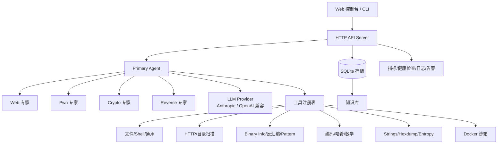

# CTF-Agent

[](https://github.com/Conly-Zy/CTF-Agent/actions/workflows/build.yml)
[](https://github.com/Conly-Zy/CTF-Agent/actions/workflows/docker.yml)

CTF-Agent 是一个面向 CTF 竞赛/靶场的 AI 辅助解题平台，提供 CLI、Web 控制台、多 LLM Provider、专业 Agent、沙箱工具、回放报告和持久化知识库。

> English documentation: [`README.md`](README.md)

## 核心特性

- **题型覆盖**：Web、Pwn、Crypto、Reverse，以及通用文件/命令行工作流。
- **多 Agent 解题**：Primary Agent 可按任务委派 Web/Pwn/Crypto/Reverse 专家 Agent，并进行反思与总结。
- **多模型提供者**：支持 Anthropic Claude 与 OpenAI 兼容的 chat-completions 接口。
- **Web 控制台**：仪表盘、会话、实时解题、工具测试、知识库搜索、配置编辑、指标、日志、告警、回放与报告。
- **知识库**：从解题过程自动提取技巧、标签、命令与代码片段，便于复用。
- **沙箱支持**：提供 Docker 执行辅助能力，降低分析题目时的环境污染风险。
- **全新环境一键启动**：使用 `./scripts/bootstrap.sh` 自动创建配置并启动 GHCR 镜像。
- **CI/CD**：GitHub Actions 自动构建二进制、发布 Release，并生成多架构 Docker 镜像。

## 全新环境一键启动

前置条件：安装 Docker 与 Compose 插件，并准备 Anthropic 或 OpenAI 兼容 API Key。

```bash
git clone https://github.com/Conly-Zy/CTF-Agent.git
cd CTF-Agent

# 自动创建 .env/data/uploads/logs，并启动 GHCR 镜像
ANTHROPIC_API_KEY="你的 API Key" ./scripts/bootstrap.sh
```

启动后访问：

```text
http://localhost:4399
```

常用变体：

```bash
# 使用 OpenAI 兼容 Provider
LLM_PROVIDER=openai OPENAI_API_KEY="你的 API Key" LLM_MODEL="gpt-4.1" ./scripts/bootstrap.sh

# 使用指定发布镜像版本
CTF_AGENT_IMAGE_TAG=v0.3.0 ./scripts/bootstrap.sh

# 不拉取 GHCR，改为本地构建镜像
./scripts/bootstrap.sh --build
```

## Docker 镜像

GitHub Actions 会自动构建并推送镜像到 GitHub Container Registry：

```text
ghcr.io/conly-zy/ctf-agent:latest
ghcr.io/conly-zy/ctf-agent:<git-tag>
ghcr.io/conly-zy/ctf-agent:sha-<short-sha>
```

手动 Docker 操作：

```bash
# 使用已发布镜像启动
cp .env.example .env
# 编辑 .env 后执行：
docker compose up -d

# 本地构建并启动
docker compose -f docker-compose.yml -f docker-compose.build.yml up -d --build

# 停止
docker compose down
```

## 本地开发

前置条件：

- `go.mod` 指定的 Go 版本
- Node.js 24+ 与 npm
- Docker（可选，用于沙箱和容器启动）

```bash
# 构建前端 + 后端
make build

# 运行测试
make test

# 使用本地配置启动后端
cp config.yaml.example config.yaml
ANTHROPIC_API_KEY="你的 API Key" make dev-backend

# 另一个终端启动前端开发服务器
make dev-frontend
```

生产构建会把 Vite 前端产物嵌入 Go 二进制。

## 配置说明

配置可来自 `config.yaml`/`data/config.yaml` 与环境变量。建议用环境变量传递密钥，避免写入仓库。

Anthropic 最小配置：

```bash
export LLM_PROVIDER=anthropic
export ANTHROPIC_API_KEY="你的 API Key"
export LLM_MODEL="claude-opus-4-7"
```

OpenAI 兼容接口最小配置：

```bash
export LLM_PROVIDER=openai
export OPENAI_API_KEY="你的 API Key"
export LLM_MODEL="gpt-4.1"
# export LLM_BASE_URL="https://api.openai.com/v1"  # 可选，自定义接口
```

配置文件示例：

```yaml
llm:
  provider: anthropic
  api_key: ""
  model: claude-opus-4-7
  base_url: ""

agent:
  max_iterations: 50
  timeout: 10m
  verbose: false

sandbox:
  enabled: true
  image: ctf-agent-sandbox:latest
  timeout: 60s
  network_mode: bridge
```

常用环境变量：

| 变量 | 说明 | 默认值 |
| --- | --- | --- |
| `LLM_PROVIDER` | `anthropic` 或 `openai` | `anthropic` |
| `LLM_API_KEY` | 通用 Provider API Key 覆盖 | 空 |
| `ANTHROPIC_API_KEY` | Anthropic API Key | 空 |
| `OPENAI_API_KEY` | OpenAI 兼容 API Key | 空 |
| `LLM_MODEL` | 模型名称覆盖 | 配置文件默认值 |
| `LLM_BASE_URL` | 自定义 Provider Base URL | 空/Provider 默认 |
| `CTF_PORT` | Docker Compose 映射到宿主机的端口 | `4399` |
| `CTF_AGENT_IMAGE` | Docker 镜像仓库 | `ghcr.io/conly-zy/ctf-agent` |
| `CTF_AGENT_IMAGE_TAG` | Docker 镜像标签 | `latest` |
| `CTF_AGENT_ADDR` | 服务监听地址 | `:4399` |
| `CTF_AGENT_CONFIG` | 配置文件路径 | `config.yaml` |
| `CTF_AGENT_DB` | SQLite 数据库路径 | `ctf-agent.db` |

## CLI 用法

### Web 题

```bash
ctf-agent solve \
  --type web \
  --description "Find the flag in this web application" \
  --target "http://challenge.example.com"
```

### Pwn 题

```bash
ctf-agent solve \
  --type pwn \
  --description "Exploit this binary to get the flag" \
  --files ./challenge.elf
```

### Crypto 题

```bash
ctf-agent solve \
  --type crypto \
  --description "Decrypt this ciphertext" \
  --files ./ciphertext.txt
```

### Reverse 题

```bash
ctf-agent solve \
  --type reverse \
  --description "Reverse engineer this binary" \
  --files ./binary.exe
```

### Web 服务

```bash
ctf-agent server --addr :4399 --config config.yaml --db ctf-agent.db
```

## Makefile 常用目标

```bash
make help
make build           # 构建前端 + Go 二进制
make test            # 运行 Go 测试
make fmt             # go fmt
make docker          # 本地构建 Docker 镜像
make docker-up       # 使用 Compose 启动已发布镜像
make docker-up-build # 使用 Compose 本地构建并启动
make docker-down     # 停止 Compose 服务
make setup           # 一键初始化并启动
```

## 架构



## API 概览

| 方法 | Endpoint | 说明 |
| --- | --- | --- |
| `GET` | `/api/dashboard` | 仪表盘统计 |
| `GET` | `/api/sessions` | 会话列表 |
| `GET` | `/api/sessions/{id}` | 会话详情 |
| `GET` | `/api/sessions/{id}/messages` | 会话对话消息 |
| `POST` | `/api/solve` | 创建解题任务 |
| `POST` | `/api/upload` | 上传题目文件 |
| `GET` | `/api/knowledge` | 知识条目列表 |
| `GET` | `/api/knowledge/search?q=` | 搜索知识库 |
| `GET` | `/api/tools` | 工具列表 |
| `GET` | `/api/config` | 读取当前配置 |
| `GET` | `/api/metrics` | 指标概览 |
| `GET` | `/api/health` | 完整健康检查 |
| `GET` | `/api/health/live` | 存活探针 |
| `GET` | `/api/health/ready` | 就绪探针 |
| `GET` | `/ws` | WebSocket 实时更新 |

## 项目结构

```text
CTF-Agent/
├── cmd/ctf-agent/          # CLI 入口与嵌入式前端资源
├── internal/agent/         # Primary/专家 Agent、反思、总结
├── internal/api/           # HTTP API、WebSocket、处理器
├── internal/config/        # YAML/环境变量配置
├── internal/knowledge/     # 知识提取
├── internal/llm/           # Anthropic 与 OpenAI 兼容 Provider
├── internal/tools/         # Common/Web/Pwn/Crypto/Reverse 工具
├── internal/store/         # SQLite 持久化
├── internal/health/        # 健康检查
├── internal/metrics/       # 指标采集
├── plugins/                # 插件示例/扩展
├── scripts/                # 一键启动与工具脚本
└── web/                    # React/Vite 前端
```

## CI/CD 与版本发布

- 推送到 `main` 会运行构建检查。
- 推送 `v*` 标签会生成 GitHub Release 二进制产物。
- 推送到 `main` 与 `v*` 标签都会生成并推送多架构 Docker 镜像到 GHCR。

发布示例：

```bash
git tag v0.3.0
git push origin main v0.3.0
```

## 安全说明

请仅在 CTF 题目、靶场或已明确授权的目标中使用 CTF-Agent。沙箱和 Docker 辅助能力可以降低风险，但不能替代正确的隔离策略。

## License

MIT License
